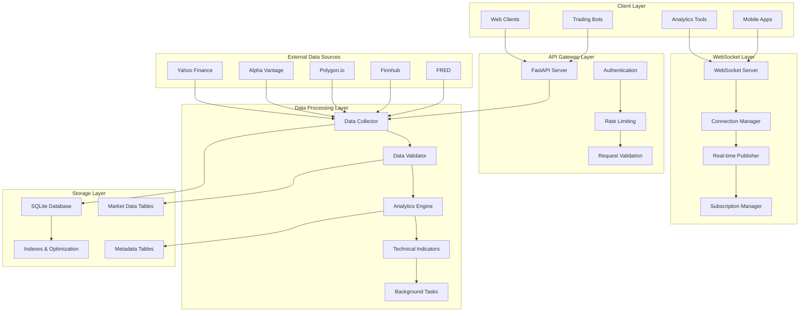
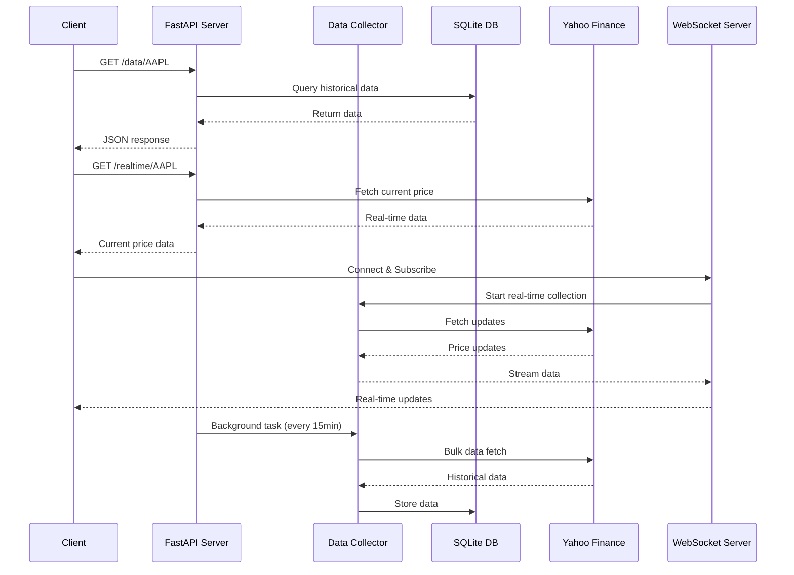
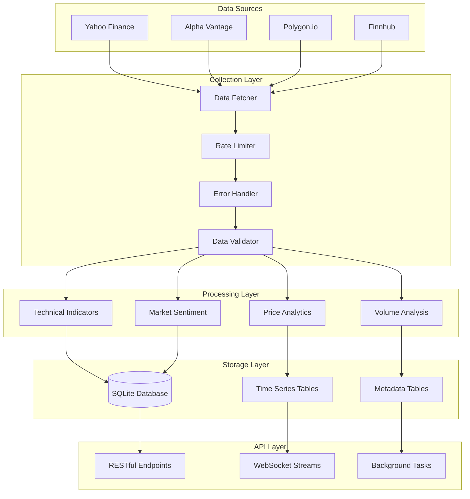

# 🌐 Market Data API

[](https://fastapi.tiangolo.com/)
[](https://www.python.org/downloads/)
[](https://www.sqlite.org/)
[](https://developer.mozilla.org/en-US/docs/Web/API/WebSockets_API)
[](https://opensource.org/licenses/MIT)

A production-ready **real-time market data API** built with FastAPI, featuring multi-source data collection, WebSocket streaming, SQLite storage, comprehensive analytics, and enterprise-grade CI/CD pipeline integration.

## 📋 Table of Contents
- [🏗️ Architecture](#%EF%B8%8F-architecture)
- [🚀 Features](#-features)
- [🛠️ Installation](#%EF%B8%8F-installation)
- [📊 API Endpoints](#-api-endpoints)
- [🔌 WebSocket Streaming](#-websocket-streaming)
- [📊 Sample Responses](#-sample-responses)
- [🎯 Use Cases](#-use-cases)
- [🚀 Deployment](#-deployment)
- [🔧 Configuration](#-configuration)
- [📝 License](#-license)

## 🏗️ Architecture

### System Overview


### API Architecture


### Data Flow Architecture


## 🚀 Features

### 📊 Core API Features
- **📡 Real-time Data Streaming**: WebSocket-based live price feeds with sub-second latency
- **🗄️ High-Performance Storage**: SQLite database with optimized indexing and query performance
- **🔄 Automated Data Collection**: Background tasks with configurable intervals (1min-1day)
- **📊 Advanced Analytics API**: 20+ technical indicators, market sentiment, and statistical metrics
- **🌐 Production-Ready API**: FastAPI with OpenAPI/Swagger docs, CORS, and error handling

### 🔌 Real-time Capabilities
- **WebSocket Streaming**: Multi-symbol real-time price feeds
- **Subscription Management**: Dynamic symbol subscription/unsubscription
- **Multiple Data Types**: Tick data, quotes, trades, and order book updates
- **Connection Management**: Automatic reconnection and heartbeat monitoring
- **Broadcast Modes**: Individual and bulk data broadcasting

### 📊 Data Sources Integration
- **Multi-Source Architecture**: Yahoo Finance, Alpha Vantage, Polygon.io, Finnhub
- **Fallback Mechanisms**: Automatic failover between data providers
- **Rate Limiting**: Built-in API rate limiting and quota management
- **Data Quality Assurance**: Validation, cleansing, and anomaly detection
- **Economic Data**: FRED integration for macroeconomic indicators

### 🚀 Advanced Features
- **Technical Analysis Engine**: RSI, MACD, Bollinger Bands, ATR, and custom indicators
- **Market Sentiment Analysis**: News sentiment aggregation and fear/greed indicators
- **Portfolio Analytics**: Real-time portfolio tracking and performance metrics
- **Historical Backtesting**: Strategy backtesting with performance attribution
- **API Authentication**: JWT tokens and API key management
- **Monitoring & Logging**: Comprehensive request/response logging and metrics

## 🛠️ Installation

```bash
git clone https://github.com/olaitanojo/market-data-api.git
cd market-data-api
pip install fastapi uvicorn pandas numpy yfinance sqlite3
python app.py
```

Visit http://localhost:8000/docs for API documentation.

## 📊 API Endpoints

### Core Data Endpoints
- **GET /**: API overview, health status, and available endpoints
- **GET /symbols**: List of available stock symbols with metadata
- **GET /data/{symbol}**: Historical OHLCV data with query parameters
- **GET /realtime/{symbol}**: Current real-time price and market data
- **GET /quote/{symbol}**: Latest quote with bid/ask spreads

### Analytics Endpoints
- **GET /analytics/{symbol}**: Complete technical analysis with 20+ indicators
- **GET /indicators/{symbol}**: Specific technical indicators (RSI, MACD, etc.)
- **GET /sentiment/{symbol}**: Market sentiment analysis and scores
- **GET /volatility/{symbol}**: Volatility metrics and statistical measures
- **GET /patterns/{symbol}**: Chart pattern recognition and signals

### Portfolio & Management
- **GET /portfolio**: Portfolio performance and risk metrics
- **POST /portfolio/add**: Add symbols to portfolio tracking
- **DELETE /portfolio/{symbol}**: Remove symbol from portfolio
- **GET /watchlist**: User watchlist management

### Data Management
- **POST /collect**: Trigger manual data collection for symbols
- **POST /collect/bulk**: Bulk data collection with progress tracking
- **GET /status/collection**: Data collection status and schedule
- **GET /health**: System health check and metrics

### Query Parameters
- `period`: Data period (1d, 5d, 1mo, 3mo, 6mo, 1y, 2y, 5y, 10y, ytd, max)
- `interval`: Data interval (1m, 2m, 5m, 15m, 30m, 60m, 90m, 1h, 1d, 5d, 1wk, 1mo, 3mo)
- `start_date`: Start date for historical data (YYYY-MM-DD)
- `end_date`: End date for historical data (YYYY-MM-DD)
- `limit`: Maximum number of records to return
- `format`: Response format (json, csv)
- `indicators`: Comma-separated list of technical indicators to include

## 📊 Sample Responses

### Real-time Quote Data
```json
{
  "symbol": "AAPL",
  "timestamp": "2024-12-29T15:30:00Z",
  "price": 175.43,
  "change": 2.15,
  "change_percent": 1.24,
  "volume": 52847392,
  "market_cap": 2847392847392,
  "bid": 175.42,
  "ask": 175.44,
  "bid_size": 100,
  "ask_size": 200
}
```

### Technical Analysis Response
```json
{
  "symbol": "AAPL",
  "timestamp": "2024-12-29T15:30:00Z",
  "indicators": {
    "rsi": 45.32,
    "macd": {
      "value": 1.23,
      "signal": 1.15,
      "histogram": 0.08
    },
    "bollinger_bands": {
      "upper": 178.45,
      "middle": 175.20,
      "lower": 171.95
    },
    "moving_averages": {
      "sma_20": 174.65,
      "sma_50": 172.30,
      "ema_12": 175.80
    }
  },
  "sentiment": {
    "score": 0.15,
    "label": "Positive",
    "confidence": 0.78
  }
}
```

### Historical Data Response
```json
{
  "symbol": "AAPL",
  "data": [
    {
      "timestamp": "2024-12-29T09:30:00Z",
      "open": 173.20,
      "high": 175.80,
      "low": 172.95,
      "close": 175.43,
      "volume": 52847392,
      "adj_close": 175.43
    }
  ],
  "metadata": {
    "total_records": 252,
    "period": "1y",
    "last_updated": "2024-12-29T15:30:00Z"
  }
}
```

## 🎯 Use Cases

### 🤖 Trading & Automation
- **Algorithmic Trading Bots**: Real-time price feeds for automated trading systems
- **High-Frequency Trading**: Sub-second latency data for HFT strategies
- **Options Trading**: Real-time options chain data and Greeks calculations
- **Arbitrage Detection**: Multi-exchange price comparison and opportunity identification

### 📊 Analytics & Research
- **Quantitative Analysis**: Historical data for statistical modeling and backtesting
- **Market Research**: Comprehensive market data for academic and professional research
- **Risk Management**: Real-time portfolio monitoring and risk assessment
- **Performance Attribution**: Detailed performance analysis and reporting

### 📱 Applications & Dashboards
- **Financial Dashboards**: Real-time market data visualization and monitoring
- **Portfolio Management**: Live portfolio tracking and performance metrics
- **Market Surveillance**: Unusual activity detection and alert systems
- **News Integration**: Correlating market movements with news events

### 🏦 Enterprise Solutions
- **Internal APIs**: White-label market data API for financial institutions
- **Compliance Monitoring**: Trade surveillance and regulatory reporting
- **Data Warehousing**: Historical data storage for enterprise analytics
- **Third-party Integration**: API gateway for external financial services

## 🔌 WebSocket Real-time Streaming

### JavaScript/TypeScript Client
```javascript
const ws = new WebSocket('ws://localhost:8765');

// Subscribe to real-time data
ws.onopen = () => {
  ws.send(JSON.stringify({
    action: 'subscribe',
    symbols: ['AAPL', 'GOOGL', 'MSFT', 'TSLA'],
    data_types: ['tick', 'quote', 'trade'],
    frequency: '1s',
    indicators: ['rsi', 'macd', 'bollinger_bands']
  }));
};

// Handle real-time updates
ws.onmessage = (event) => {
  const data = JSON.parse(event.data);
  console.log('Real-time update:', {
    symbol: data.symbol,
    price: data.price,
    change: data.change_percent,
    volume: data.volume,
    timestamp: data.timestamp
  });
};

// Unsubscribe from specific symbols
ws.send(JSON.stringify({
  action: 'unsubscribe',
  symbols: ['MSFT']
}));
```

### Python WebSocket Client
```python
import asyncio
import websockets
import json

async def market_data_client():
    uri = "ws://localhost:8765"
    
    async with websockets.connect(uri) as websocket:
        # Subscribe to symbols
        subscribe_msg = {
            "action": "subscribe",
            "symbols": ["AAPL", "GOOGL", "MSFT"],
            "data_types": ["tick", "quote"],
            "frequency": "1s"
        }
        await websocket.send(json.dumps(subscribe_msg))
        
        # Listen for updates
        while True:
            try:
                message = await websocket.recv()
                data = json.loads(message)
                print(f"Received: {data['symbol']} @ ${data['price']}")
            except websockets.exceptions.ConnectionClosed:
                break

asyncio.run(market_data_client())
```

### Multiple Data Sources
- **Alpha Vantage**: Real-time quotes and historical data
- **Polygon.io**: Professional-grade market data
- **Finnhub**: Financial news and company data
- **FRED**: Economic indicators and macro data
- **Yahoo Finance**: Backup data source

---
Created by [olaitanojo](https://github.com/olaitanojo)
